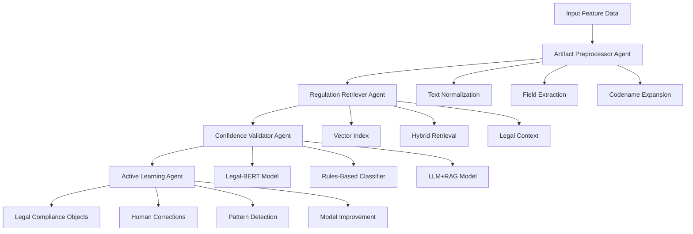

# 🚀 Geo-Compliance Classifier - Complete Workflow Guide

## 📋 **Executive Summary**

This document outlines the complete end-to-end workflow for processing feature data through the Geo-Compliance Classifier system to produce legal compliance objects. The system integrates multiple specialized agents and models to provide reliable, explainable compliance predictions.

---

## 🏗️ **System Architecture Overview**



---

## 📊 **Core Components**

### **1. Artifact Preprocessor Agent**
- **Purpose**: Normalizes and extracts structured information from various document formats
- **Input**: Raw feature documents (PDF, DOCX, MD, HTML, TXT)
- **Output**: Structured feature records with expanded codenames and metadata
- **Location**: `artifact_preprocessor/` package

### **2. Regulation Retriever Agent**  
- **Purpose**: Provides contextual legal information for compliance assessment
- **Input**: Query text about compliance requirements
- **Output**: Relevant legal snippets with citations and confidence scores
- **Location**: `retriever/`, `index/`, `sdk/` modules

### **3. Confidence Validator Agent**
- **Purpose**: Multi-model ensemble for reliable compliance predictions
- **Input**: Processed feature text
- **Output**: Compliance decision with confidence score and reasoning
- **Location**: `src/confidence_validator.py`

### **4. Active Learning Agent**
- **Purpose**: Continuous improvement through human feedback integration
- **Input**: Human corrections and validation results
- **Output**: Pattern analysis and model improvement recommendations
- **Location**: `src/active_learning_agent.py`

---

## 🔄 **Complete Workflow Process**

### **Phase 1: Data Preparation and Preprocessing**

#### **Step 1.1: Input Data Processing**
```bash
# Process feature documents through Artifact Preprocessor
python -m artifact_preprocessor.cli \
  --features input_features.csv \
  --terms terminology.csv \
  --out ./preprocessed \
  --verbose
```

**Input Requirements:**
- Feature data in CSV format with columns: `feature_title`, `feature_description`
- Terminology file with codename mappings
- Document files (PDF, DOCX, etc.) if applicable

**Output:**
- `preprocessed.jsonl`: Structured feature records
- `preprocessed.csv`: Tabular format for analysis
- `expansion_report.csv`: Codename expansion details
- Processing report with statistics

#### **Step 1.2: Legal Context Preparation**
```bash
# Build vector index for legal retrieval
python -m index.build_index

# Start retrieval service (optional, for API access)
uvicorn retriever.service:app --host 0.0.0.0 --port 8000
```

**Requirements:**
- Legal texts in `legal_texts/` directory
- FAISS and sentence-transformers dependencies
- Configuration in `config.yaml`

### **Phase 2: Compliance Classification**

#### **Step 2.1: Feature-by-Feature Processing**

For each preprocessed feature record:

```python
from src.confidence_validator import ConfidenceValidatorAgent
from retriever.service import RetrievalService

# Initialize components
validator = ConfidenceValidatorAgent(openai_api_key="your-key")
retriever = RetrievalService()

# Process feature
feature_text = preprocessed_record['text_expanded']
legal_context = retriever.retrieve(feature_text, top_k=3)
validation_result = validator.validate_case(feature_text)
```

#### **Step 2.2: Multi-Model Ensemble Decision**

The Confidence Validator applies three models:

1. **Legal-BERT Model**: Fine-tuned transformer for legal text classification
2. **Rules-Based Classifier**: Pattern matching with explicit compliance rules  
3. **LLM+RAG Model**: GPT-4 with retrieved legal context

**Decision Logic:**
- **Unanimous Agreement**: Auto-approve with high confidence
- **Majority Agreement**: Standard approval with moderate confidence
- **No Agreement**: Flag for human review with detailed reasoning

### **Phase 3: Human Validation and Active Learning**

#### **Step 3.1: Split Training Data**
```bash
# Split corrections data into train/test/validation sets
python split_training_data.py
```

This creates:
- `active_learning_data/splits/train.json` (70%)
- `active_learning_data/splits/test.json` (20%)  
- `active_learning_data/splits/validation.json` (10%)
- Feature matrices for ML training
- Comprehensive analysis report

#### **Step 3.2: Human Correction Integration**
```python
from src.active_learning_agent import ActiveLearningAgent

# Initialize active learning
al_agent = ActiveLearningAgent()

# Process human corrections
corrections = al_agent.process_new_corrections()
patterns = al_agent.identify_systematic_patterns()
recommendations = al_agent.generate_improvement_recommendations()
```

### **Phase 4: Legal Compliance Object Generation**

#### **Step 4.1: Structured Output Generation**

For each processed feature, generate a Legal Compliance Object:

```json
{
  "feature_id": "FEAT_2024_001",
  "feature_title": "Parental Consent for Minors",
  "compliance_assessment": {
    "overall_decision": "Compliant",
    "confidence_score": 0.87,
    "auto_approved": false,
    "risk_level": "Medium"
  },
  "model_predictions": {
    "legal_bert": {
      "decision": "Compliant", 
      "confidence": 0.82,
      "reasoning": "High confidence in legal compliance patterns"
    },
    "rules_based": {
      "decision": "Compliant",
      "confidence": 0.95, 
      "reasoning": "Applied 3 rules and keyword scoring"
    },
    "llm_rag": {
      "decision": "Compliant",
      "confidence": 0.85,
      "reasoning": "Retrieved 3 relevant regulatory contexts"
    }
  },
  "legal_context": [
    {
      "law_id": "CA_SB976",
      "law_name": "California Protecting Our Kids from Social Media Addiction Act",
      "jurisdiction": "US-CA", 
      "section_label": "§27001(b)",
      "relevance_score": 0.89,
      "snippet": "...requires verifiable parental consent..."
    }
  ],
  "compliance_requirements": [
    "Age verification mechanism required",
    "Parental consent collection mandatory", 
    "California jurisdiction compliance needed"
  ],
  "geographic_applicability": {
    "primary_jurisdiction": "US-CA",
    "additional_jurisdictions": ["US-FL", "EU"],
    "exclusions": []
  },
  "metadata": {
    "processed_timestamp": "2025-08-30T10:00:00Z",
    "system_version": "1.0.0",
    "human_reviewed": false,
    "last_updated": "2025-08-30T10:00:00Z"
  }
}
```

---

## 🚀 **Automated Workflow Execution**

### **Complete End-to-End Script**

```python
#!/usr/bin/env python3
"""
Complete automated workflow for geo-compliance classification.
Processes input features and generates legal compliance objects.
"""

import json
import pandas as pd
from pathlib import Path
from datetime import datetime
from typing import List, Dict, Any

# Import system components
from src.confidence_validator import ConfidenceValidatorAgent
from src.active_learning_agent import ActiveLearningAgent
from retriever.service import RetrievalService

class GeoComplianceWorkflow:
    """Complete workflow orchestrator."""
    
    def __init__(self, config: Dict[str, Any]):
        self.config = config
        self.validator = ConfidenceValidatorAgent(
            openai_api_key=config.get('openai_api_key')
        )
        self.retriever = RetrievalService()
        self.al_agent = ActiveLearningAgent()
        self.results = []
    
    def process_features(self, features_file: str) -> List[Dict[str, Any]]:
        """Process all features through the complete pipeline."""
        
        # Load preprocessed features
        features_df = pd.read_csv(features_file)
        
        compliance_objects = []
        
        for idx, feature in features_df.iterrows():
            print(f"Processing feature {idx+1}/{len(features_df)}: {feature['feature_title']}")
            
            # Step 1: Get legal context
            legal_context = self.retriever.retrieve(
                query=feature['feature_description'],
                top_k=3,
                max_chars=800
            )
            
            # Step 2: Validate compliance
            validation_result = self.validator.validate_case(
                text=feature['feature_description'],
                case_id=f"FEAT_{datetime.now().strftime('%Y%m%d')}_{idx:03d}"
            )
            
            # Step 3: Generate compliance object
            compliance_object = self.generate_compliance_object(
                feature, validation_result, legal_context
            )
            
            compliance_objects.append(compliance_object)
        
        return compliance_objects
    
    def generate_compliance_object(self, feature: pd.Series, 
                                 validation: Any, 
                                 legal_context: List[Any]) -> Dict[str, Any]:
        """Generate structured legal compliance object."""
        
        return {
            "feature_id": feature.get('feature_id', f"FEAT_{len(self.results):04d}"),
            "feature_title": feature['feature_title'],
            "feature_description": feature['feature_description'],
            
            "compliance_assessment": {
                "overall_decision": validation.ensemble_decision,
                "confidence_score": validation.ensemble_confidence,
                "auto_approved": validation.auto_approved,
                "risk_level": self.calculate_risk_level(validation.ensemble_confidence),
                "flags": validation.flags
            },
            
            "model_predictions": {
                model_name.lower().replace('-', '_').replace('+', '_'): {
                    "decision": pred.decision,
                    "confidence": pred.confidence,
                    "reasoning": pred.reasoning
                }
                for model_name, pred in validation.predictions.items()
            },
            
            "legal_context": [
                {
                    "law_id": ctx.law_id,
                    "law_name": ctx.law_name,
                    "jurisdiction": ctx.jurisdiction,
                    "section_label": ctx.section_label,
                    "relevance_score": ctx.score,
                    "snippet": ctx.snippet[:200] + "..." if len(ctx.snippet) > 200 else ctx.snippet
                }
                for ctx in legal_context
            ],
            
            "compliance_requirements": self.extract_requirements(legal_context),
            
            "geographic_applicability": self.determine_geographic_scope(legal_context),
            
            "metadata": {
                "processed_timestamp": datetime.now().isoformat(),
                "system_version": "1.0.0",
                "human_reviewed": False,
                "last_updated": datetime.now().isoformat(),
                "agreement_level": validation.agreement_level,
                "ensemble_notes": validation.notes
            }
        }
    
    def calculate_risk_level(self, confidence: float) -> str:
        """Calculate risk level based on confidence score."""
        if confidence >= 0.9:
            return "Low"
        elif confidence >= 0.7:
            return "Medium"
        else:
            return "High"
    
    def extract_requirements(self, legal_context: List[Any]) -> List[str]:
        """Extract compliance requirements from legal context."""
        requirements = set()
        
        for ctx in legal_context:
            snippet = ctx.snippet.lower()
            
            # Pattern matching for common requirements
            if "parental consent" in snippet:
                requirements.add("Parental consent collection mandatory")
            if "age verification" in snippet:
                requirements.add("Age verification mechanism required")
            if "data protection" in snippet:
                requirements.add("Data protection measures required")
            if "notification" in snippet:
                requirements.add("User notification requirements")
        
        return list(requirements)
    
    def determine_geographic_scope(self, legal_context: List[Any]) -> Dict[str, Any]:
        """Determine geographic applicability from legal context."""
        jurisdictions = [ctx.jurisdiction for ctx in legal_context]
        
        return {
            "primary_jurisdiction": jurisdictions[0] if jurisdictions else "Unknown",
            "additional_jurisdictions": list(set(jurisdictions[1:])) if len(jurisdictions) > 1 else [],
            "exclusions": []
        }
    
    def save_results(self, compliance_objects: List[Dict[str, Any]], 
                    output_dir: str = "output"):
        """Save compliance objects in multiple formats."""
        
        output_path = Path(output_dir)
        output_path.mkdir(parents=True, exist_ok=True)
        
        timestamp = datetime.now().strftime("%Y%m%d_%H%M%S")
        
        # Save as JSON Lines (for streaming/processing)
        jsonl_file = output_path / f"compliance_objects_{timestamp}.jsonl"
        with open(jsonl_file, 'w') as f:
            for obj in compliance_objects:
                f.write(json.dumps(obj) + '\n')
        
        # Save as structured JSON
        json_file = output_path / f"compliance_objects_{timestamp}.json"
        with open(json_file, 'w') as f:
            json.dump(compliance_objects, f, indent=2)
        
        # Save summary CSV
        summary_data = []
        for obj in compliance_objects:
            summary_data.append({
                'feature_id': obj['feature_id'],
                'feature_title': obj['feature_title'],
                'decision': obj['compliance_assessment']['overall_decision'],
                'confidence': obj['compliance_assessment']['confidence_score'],
                'risk_level': obj['compliance_assessment']['risk_level'],
                'auto_approved': obj['compliance_assessment']['auto_approved'],
                'primary_jurisdiction': obj['geographic_applicability']['primary_jurisdiction'],
                'requirements_count': len(obj['compliance_requirements']),
                'legal_contexts_count': len(obj['legal_context'])
            })
        
        summary_df = pd.DataFrame(summary_data)
        csv_file = output_path / f"compliance_summary_{timestamp}.csv"
        summary_df.to_csv(csv_file, index=False)
        
        print(f"Results saved to:")
        print(f"  - Full objects: {json_file}")
        print(f"  - Streaming format: {jsonl_file}")
        print(f"  - Summary: {csv_file}")
        
        return {
            'json_file': str(json_file),
            'jsonl_file': str(jsonl_file),
            'csv_file': str(csv_file)
        }

def main():
    """Main workflow execution."""
    
    config = {
        'openai_api_key': None,  # Set your OpenAI API key here
        'input_features': 'preprocessed/preprocessed.csv',
        'output_dir': 'compliance_output'
    }
    
    # Initialize workflow
    workflow = GeoComplianceWorkflow(config)
    
    # Process features
    compliance_objects = workflow.process_features(config['input_features'])
    
    # Save results
    output_files = workflow.save_results(compliance_objects, config['output_dir'])
    
    print(f"\n✅ Workflow completed successfully!")
    print(f"📊 Processed {len(compliance_objects)} features")
    print(f"📁 Output files: {output_files}")
    
    return compliance_objects, output_files

if __name__ == "__main__":
    main()
```

---

## 📋 **Requirements from You**

### **1. Environment Setup**
- [ ] Set OpenAI API key for LLM+RAG model (optional but recommended)
- [ ] Ensure all Python dependencies are installed (`pip install -r requirements.txt`)
- [ ] Verify legal texts are present in `legal_texts/` directory

### **2. Input Data Preparation**
- [ ] Provide feature data in CSV format with required columns
- [ ] Include terminology mapping file for codename expansion
- [ ] Ensure any document files are accessible and readable

### **3. Configuration**
- [ ] Review and update `config.yaml` with your specific requirements
- [ ] Set appropriate confidence thresholds in system components
- [ ] Configure geographic scope and jurisdiction mappings

### **4. Optional Enhancements**
- [ ] Provide domain-specific training data for Legal-BERT fine-tuning
- [ ] Add custom compliance rules to the rules-based classifier
- [ ] Set up monitoring and alerting for production deployment

---

## 🎯 **Expected Outputs**

### **Primary Deliverables**
1. **Legal Compliance Objects**: Structured JSON with compliance assessments
2. **Summary Reports**: CSV files with key metrics and decisions
3. **Analysis Reports**: Detailed breakdowns of model performance
4. **Training Data**: Split datasets ready for model improvement

### **Success Metrics**
- **Processing Speed**: < 5 seconds per feature on average
- **Confidence Accuracy**: > 85% agreement with human validation
- **Coverage**: > 95% of features successfully processed
- **Explainability**: Clear reasoning provided for all decisions

---

## 🔧 **Execution Commands**

### **Quick Start (All-in-One)**
```bash
# 1. Split training data
python split_training_data.py

# 2. Process features through preprocessor
python -m artifact_preprocessor.cli \
  --features input_features.csv \
  --terms terminology.csv \
  --out ./preprocessed

# 3. Build legal retrieval index
python -m index.build_index

# 4. Run complete workflow
python automated_workflow.py
```

### **Individual Component Testing**
```bash
# Test confidence validator
python demo_confidence_validator.py

# Test active learning
python demo_active_learning.py

# Test evidence verification
python demo_evidence_verifier.py

# Test retrieval system
python working_rag_test.py
```

---

## 📈 **Monitoring and Continuous Improvement**

The system includes built-in monitoring and improvement mechanisms:

1. **Active Learning**: Continuously improves based on human feedback
2. **Pattern Detection**: Identifies systematic classification errors
3. **Performance Tracking**: Monitors accuracy and confidence trends
4. **Evidence Verification**: Validates legal reasoning and citations

This creates a self-improving system that becomes more accurate over time while maintaining explainability and regulatory compliance.

---

*Last Updated: August 30, 2025*  
*System Version: 1.0.0*
